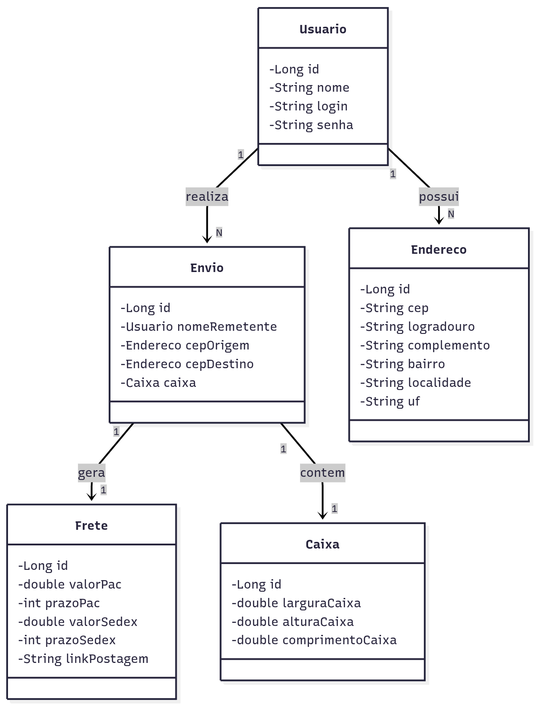

# Envio Rápido API  
_Cadastro e cálculo de frete via APIs externas_  
Este projeto disponibiliza uma API em Spring Boot para cadastro de usuário, endereços, e consulta de cálculo de frete (por transportadoras externas) para pedidos.

---

## 📌 Visão Geral  
A API oferece funcionalidades como:  
- Cadastro de usuários e seus endereços.  
- Consulta e cálculo de frete para pedidos, integrando com serviços de API externa MelhorEnvio e ViaCep para validar o CEP.  
- Estrutura em Java com Docker Compose.  
- Arquivo `docker-compose.yml` incluso para orquestrar dependências.
- Diagrama da arquitetura disponível em **`src/img/diagram.png`** para facilitar entendimento visual.

### Diagrama  
 

---

## 🧰 Tecnologias usadas  
- Java 21
- Spring Boot 3.5.7  
- Maven 4.0.0
- Docker / Docker Compose 

---

## 🎯 Boas práticas adotadas e recomendadas  
### Adoção no projeto  
- Separação clara entre camadas (controler, serviço, repositório) 
- Uso de docker-compose para levantar rapidamente ambientes (neste caso o RabbitMQ).  
- Diagrama de arquitetura para comunicação clara com stakeholders.  
- Estrutura de projeto limpa: `.gitignore`, `.gitattributes`, wrappers Maven (`mvnw`, `mvnw.cmd`).  

### Garantia de qualidade  
- **Documentação da API**: implementação do Swagger/OpenAPI para gerar documentação interativa para endpoints.  
- **Validação de entradas**: garantir que payloads inválidos sejam rejeitados com respostas apropriadas (HTTP 4xx).  
- **Tratamento de erros padronizado**: criar classes de exceção global (ex: `@ControllerAdvice`) para unificar respostas de erro.  
- **Testes automatizados**: unitários (Mockito) + integração. Cobertura mínima recomendada (~80%).  
- **Logs estruturados**: usar padrão (ex: SLF4J + Logback) com correlações de requisição para facilitar debug em produção.  
- **Segurança/configuração por ambiente**: não hard-codear segredos.
- **Gerenciamento de versões**: v1.0.0.

---

## 🚀 Como rodar localmente  
1. Clone o repositório:  
   ```bash
   git clone https://github.com/alexandraparra/envio-rapido-api.git
   cd envio-rapido-api

2. Inicie com Docker Compose
   ```
   docker-compose up --build

3. Execute a aplicação via Maven
   ```
   ./mvnw spring-boot:run
4. Acesse ao Swagger
   ```
   http://localhost:8080/swagger-ui/index.html
